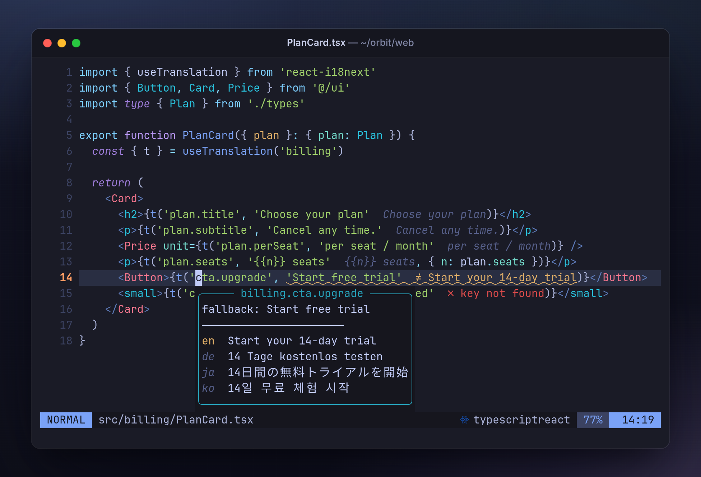
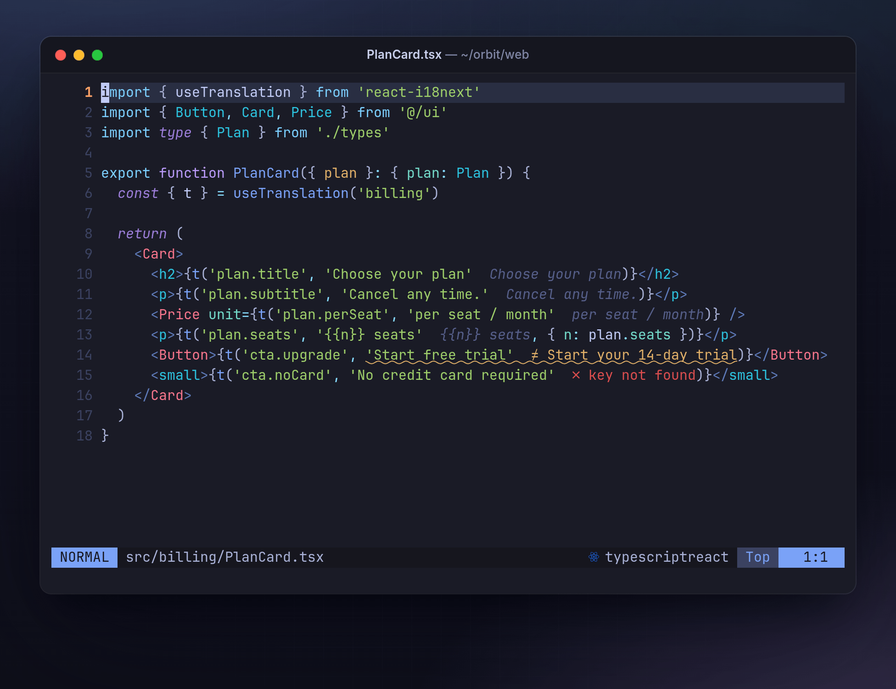
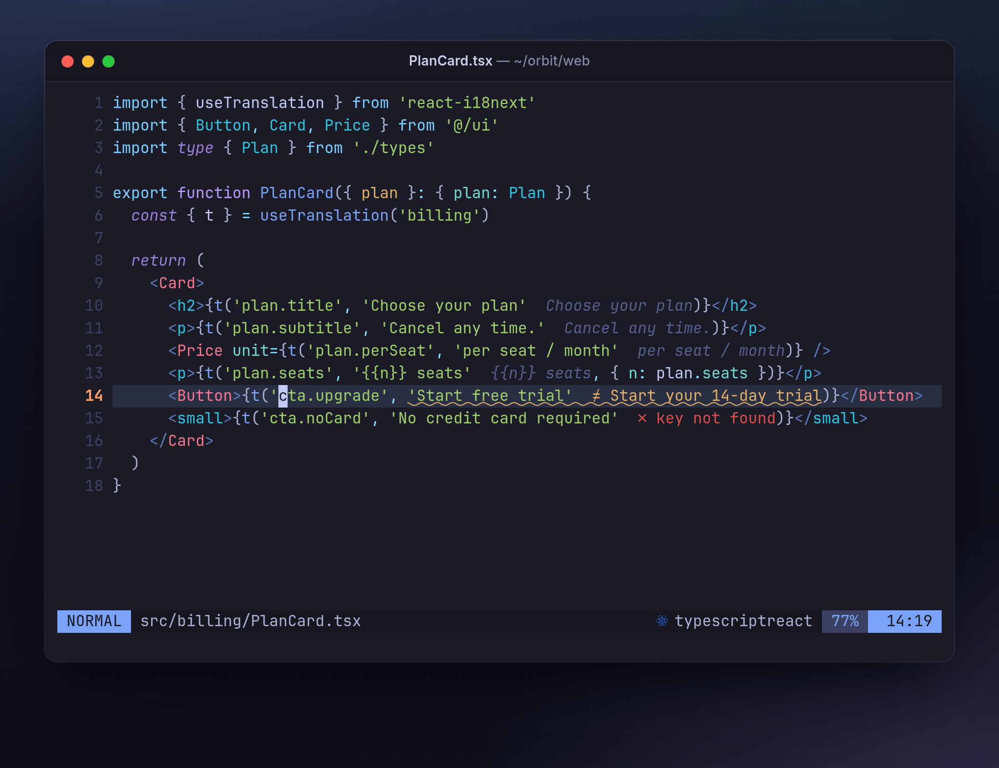
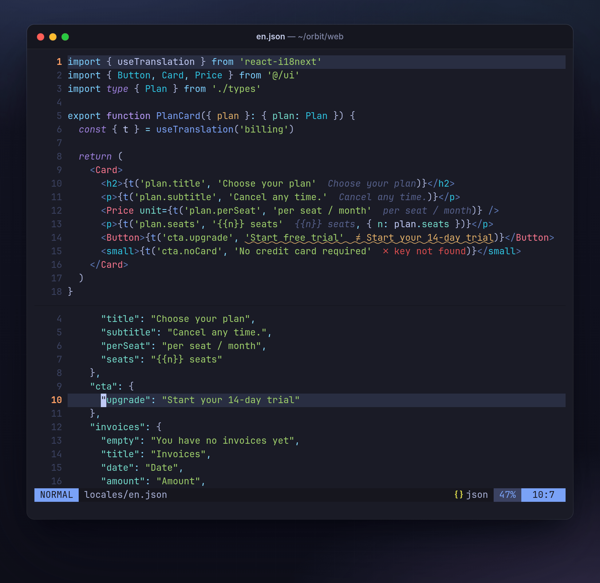
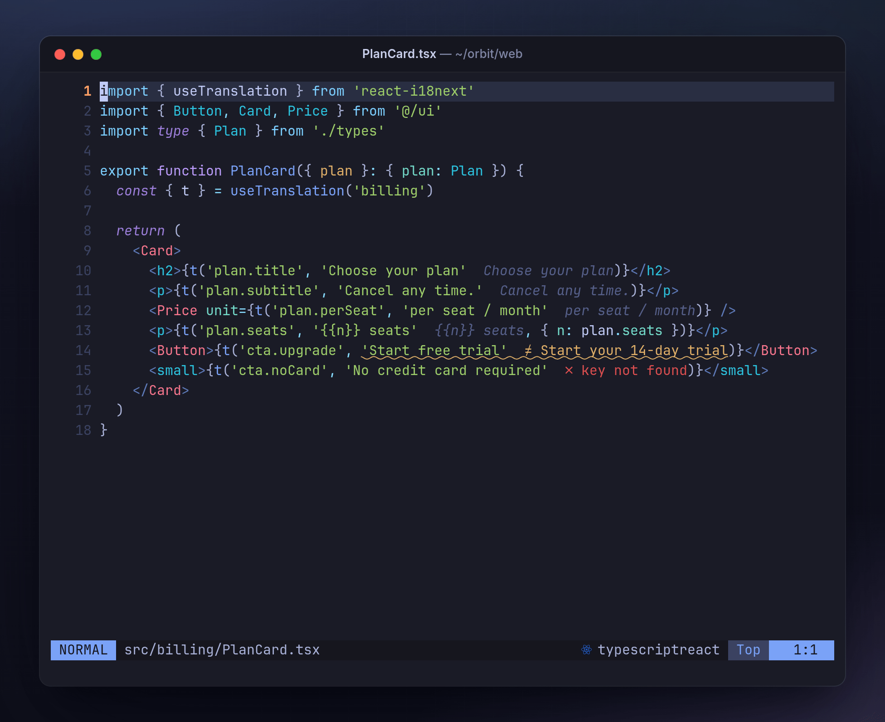
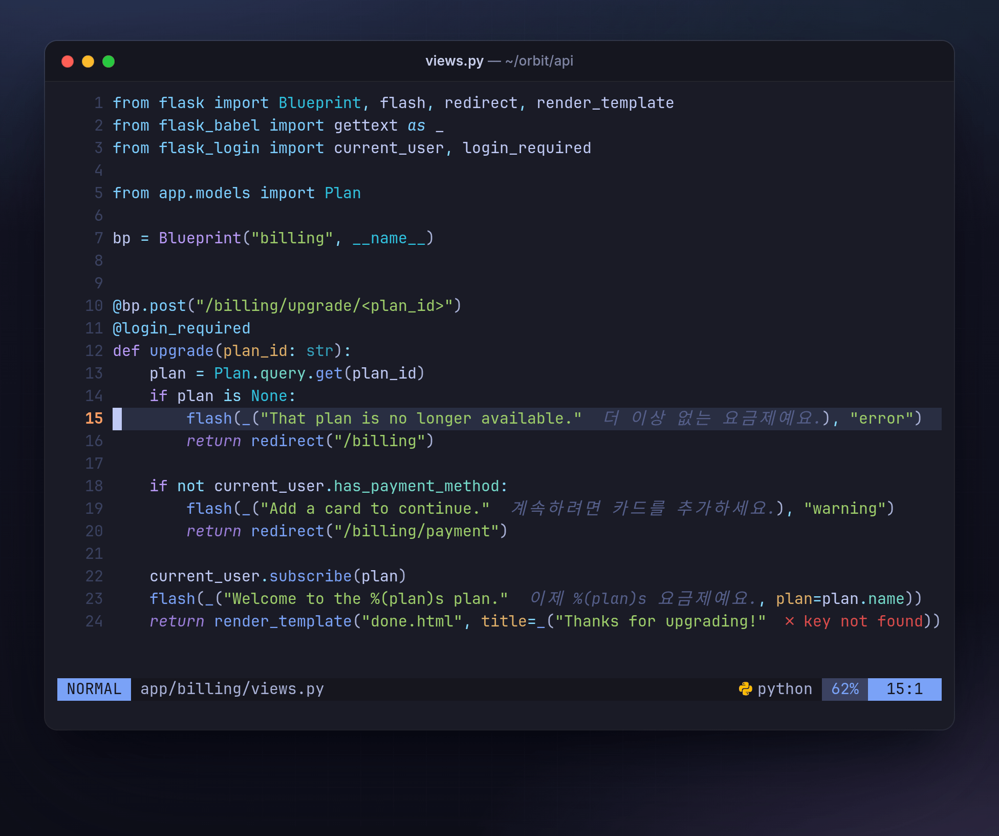

# i18n-inline.nvim

[](https://github.com/BitYoungjae/i18n-inline.nvim/actions/workflows/test.yml)

See the real translation next to every `t('key')` while you edit, and catch
the places where your code and your translation files disagree.



A lot of i18n code keeps the same sentence in two places: a default string
in the code and the real value in a translation file. Someone rewords
`en.json`, the code keeps the old text, and nobody notices. i18n-inline
reads your translation files and prints each key's value right after the
call.

- Gray text: the file agrees with the code.
- `≠` in yellow: the file says something else, and that's what users see.
- `✗` in red: no translation file has the key.

It works with i18next, next-intl, vue-i18n, Flutter gen-l10n and gettext,
and with anything else you can describe in a Lua pattern. Translation files
can be JSON (flat or nested), `.arb` or `.po`. Neovim 0.10 or newer, no
dependencies.

## Setup

**1. Install the plugin.** With [lazy.nvim](https://github.com/folke/lazy.nvim):

```lua
{
  'BitYoungjae/i18n-inline.nvim',
  opts = {
    keymaps = { hover = '<leader>ii', jump = '<leader>ij', toggle = '<leader>ui' },
  },
}
```

The plugin maps nothing by default, so the keys above are only a
suggestion. You can also map `<Plug>(i18n-inline-hover)`,
`<Plug>(i18n-inline-jump)` and `<Plug>(i18n-inline-toggle)` yourself.
(LazyVim users: skip `gK`. LazyVim takes it per buffer when an LSP
attaches.)

Don't lazy-load it. It costs well under a millisecond at startup and loads
the rest when a buffer needs it. A lazy-loaded plugin is invisible to
`:checkhealth`, and with lazy.nvim's `keys` nothing shows until you press
one. So no `ft`, `event` or `cmd`, and if you map keys through `keys`, add
`lazy = false`.

**2. Add `.i18n-inline.json` to the root of your project.**

```json
{ "preset": "i18next", "dir": "locales", "preview_lang": "en", "source_lang": "en" }
```

`dir` is the folder with your translation files and `preview_lang` is the
language shown inline. If your calls carry default strings, preview the
language they're written in. `source_lang` is the language the others are
translated from, which lets the plugin point out keys a language is still
missing. Pick the preset for your library: `i18next`, `next-intl`,
`vue-i18n`, `flutter` or `gettext`. There are
[examples for each](docs/configuration.md#examples-by-stack).

If the repository keeps translations in several directories (one per
package, page or email template), list them all in this one file with
`catalogs` rather than adding a project file per directory. See
[Several translation directories](docs/configuration.md#several-translation-directories).

**3. Open a file that uses translations.** If nothing shows up, run
`:checkhealth i18n-inline`. It tells you whether the project was found,
whether every translation file parsed, and whether the patterns match calls
in your code.

### Or let an AI agent set it up

Run your coding agent (Claude Code, Codex, Cursor, …) in your project and
paste this:

```text
Set up the Neovim plugin i18n-inline.nvim for this repository.
Docs (fetch both in full as raw files, not the GitHub HTML pages):
- https://raw.githubusercontent.com/BitYoungjae/i18n-inline.nvim/master/README.md
- https://raw.githubusercontent.com/BitYoungjae/i18n-inline.nvim/master/docs/configuration.md
If you cannot fetch either one completely, stop and tell me instead of
configuring from memory or guessing.

1. Find out how this repo does i18n: the library, what translation calls
   look like in the code, where the translation files are, their format
   and file layout, which language is the source, and whether calls carry
   a default string.
2. Write .i18n-inline.json at the repo root. Use a preset if one fits and
   add only what differs from it; otherwise write Lua patterns (not regex)
   as the docs describe. If translations live in several directories,
   list them all in `catalogs` in this one file (a `*` matches one
   directory level); never write a project file per directory. If calls
   carry defaults, preview the language they're written in; if not, ask me
   which language to preview.
3. Add the plugin to my Neovim config with the plugin manager I already
   use, without lazy-loading it (no ft/event/cmd triggers; with lazy.nvim
   `keys`, also set lazy = false), and map hover, jump and toggle to keys
   that are free in my config.
4. From the repo root, run
     nvim --headless "+checkhealth i18n-inline" "+w! /tmp/i18n-health.txt" +qa
   and fix the config until the project is found, every translation file
   parses, and the patterns match calls in the code. Calls whose keys are
   found only in catalogs their file doesn't read usually mean the file
   gets its messages from another directory at runtime (a shared
   component fed through props): map it in `uses`, or tell me if it
   shouldn't. Then run the audit:
     nvim --headless +I18nCheck "+sleep 2" "+redir! > /tmp/i18n-check.txt" \
       "+silent! clist" "+silent messages" "+redir END" +qa
   Keys reported unused because the code reaches them indirectly (built
   at runtime, passed around as strings, behind a wrapper) go in
   check.ignore, and so do keys reported missing because the code adds
   them to the messages at runtime; list those for me. Other mismatches
   and missing keys are findings for me, not something to configure
   away.
5. Show me the final config, the health check, the audit summary, and
   anything the plugin can't cover.
```

## Usage

### Every language at a glance



Put the cursor on a call and press the hover key, or run `:I18nHover`. The
popover shows the default from the code and the value in each language.
When the preview language differs from the code, it's highlighted.

### Jump to the translation



The jump key (`:I18nJump`) opens the preview language's file on the key's
line. `:I18nJump ko` opens a specific language and tab-completes the
names. `:I18nJump!` puts the key's line from every language into the
quickfix list. `<C-o>` takes you back.

### Edits show up right away



Save a translation file and every open buffer picks up the new value.
Change a default string in the code and the marker updates as you type.

### Check the whole project



`:I18nCheck` reads every source file in the project and fills the
quickfix list with:

- defaults that differ from the translation file
- keys that no file has
- keys that exist in `source_lang` but not in another language

Keys that no code uses are listed in the message area.

### Show less



The toggle key (`:I18nToggle`) switches between showing every value, only
problems, and nothing. The popover, jumps and `:I18nCheck` keep working in
every mode. To start in a quieter mode, set `show = 'problems'`.

## Commands

| Command | Does |
| --- | --- |
| `:I18nHover` | popover with the key in every language |
| `:I18nJump [lang]` | open the translation file at the key (`!` lists every language in quickfix) |
| `:I18nToggle` | cycle inline display: always, problems, never |
| `:I18nCheck` | audit the project into the quickfix list |
| `:checkhealth i18n-inline` | check the setup for the current buffer's project |

All of them work before `setup()` is called.

## Configuration

Settings come from two places. `setup()` holds your personal preferences;
`.i18n-inline.json` holds the project's (where the files are, which
preset, which language to preview). Project file values win. Options people
change most:

```lua
opts = {
  show = 'problems',             -- 'always' | 'problems' | 'never'
  position = 'eol',              -- put values at the end of the line
  normalize = 'placeholders',    -- treat {name} and %s as equal
  jump = { open = 'vsplit' },    -- 'edit' | 'split' | 'vsplit' | 'tab' | 'quickfix'
}
```

Every option, the highlight groups, and how to write patterns for a setup
no preset covers are in [docs/configuration.md](docs/configuration.md).

## Limitations

- Keys built at runtime, like `t(prefix + '.title')` or
  `` t(`${section}.title`) ``, are not resolved. They never get a false
  marker, and `check.ignore` keeps them out of the unused-key list.
- Namespaces are only picked up from `const` bindings with a string
  literal, in the same file as the calls. A `t` passed into another
  function, or wrapped in one, isn't followed.
- Which catalog a file reads is decided by where it sits. Code that gets
  its messages at runtime (props, context) needs a `uses` entry.
- One file per language. The i18next layout with one file per namespace
  (`locales/<lang>/<ns>.json`) isn't supported yet; `file_template` can
  point at a single namespace file.
- A default string that spans lines (a template literal with a newline)
  counts as no default: you see the value, without a comparison.
- JSON, `.arb` and `.po` only. `.po` entries with `msgctxt` are skipped.
  Adding a format means writing one decoder; see `lua/i18n-inline/formats.lua`.

## Development

```sh
nvim --headless -u NORC +'luafile tests/run.lua'
stylua --check .
```

Set `I18N_SMOKE_REPO=/path/to/repo` to also run a smoke test against a real
project. The screenshots and GIFs are recorded from a real headless Neovim;
[media/](media/) has the scripts to regenerate them. Design notes are in
[docs/DESIGN.md](docs/DESIGN.md).

## License

MIT
