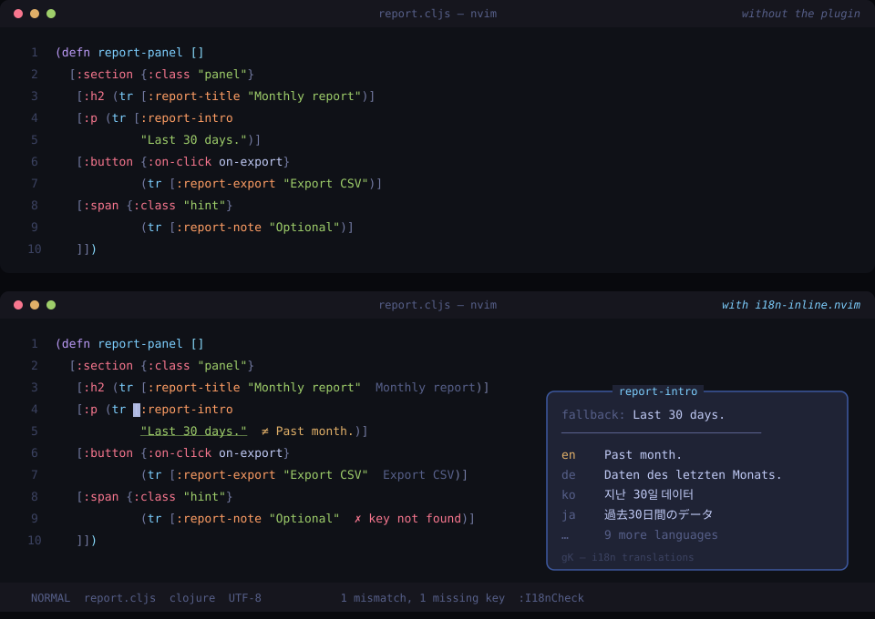

# i18n-inline.nvim

Show the actual translation value next to every i18n call, while you edit.



*Top: the raw buffer. Bottom: the same buffer with the plugin active — the
gray text after each string (not present in the file) is the value from the
translation file. Gray means it matches the fallback, `≠` marks drift, `✗`
marks a missing key, and the popover shows `gK`.*

When code contains `(tr [:billing-usage-title "Usage"])`, the string literal is
only a fallback — the text users see comes from a translation file. The two
drift apart silently: a wording fix in the JSON never reaches the code, and a
code edit never reaches the JSON. This plugin surfaces the real value inline
so the drift is visible at a glance, in every affected file.

## What it does

- **Inline preview** — virtual text right after each fallback string shows the
  value from the preview language's translation file (gray).
- **Drift markers** — when the fallback differs from the file (`≠`, warning
  color, plus an underline on the string) or the key is absent from the file
  (`✗`, error color).
- **Language popover** — `<Plug>(i18n-inline-hover)` (suggested mapping: `gK`)
  shows every language's value for the key under the cursor, plus the code
  fallback, with mismatching languages highlighted.
- **Project audit** — `:I18nCheck` scans the whole project and fills the
  quickfix list with every mismatch and missing key. It also reports
  translation keys that no code references.
- **Per-project configuration** — a `.i18n-inline.json` at the repository root,
  discovered automatically by walking up from each buffer.

## Requirements

- Neovim 0.10 or later.
- No plugin dependencies. Translation files are JSON.

## Installation

With lazy.nvim:

```lua
{
  'i18n-inline.nvim',
  dir = '~/Work/i18n-inline.nvim', -- or a proper git URL
  ft = { 'clojure' },              -- or your filetypes
  opts = {},
}
```

The plugin does nothing in buffers that don't resolve to a project (see
below), so loading it for all filetypes is also fine.

## Configuration

Options come from two places, merged in this order (later wins per key):

1. built-in defaults, overridden by `setup(opts)` — user-level;
2. the project file `.i18n-inline.json` (name configurable) found at the
   nearest ancestor directory of the buffer.

Minimal project file for a ClojureScript app:

```json
{
  "dir": "src/tr/cljs",
  "preview_lang": "ko"
}
```

All options (same keys in `setup()` and the project file):

| Option | Default | Meaning |
| --- | --- | --- |
| `project_file` | `'.i18n-inline.json'` | per-project config file name |
| `dir` | `nil` | translation directory; absolute, or relative to the project root (discovered upward from the buffer) |
| `languages` | `nil` | language list; nil discovers `*.json` in `dir` (`ko.json` → `"ko"`) |
| `file_template` | `nil` | language → file template, e.g. `'locales/%s.json'`; requires `languages` |
| `preview_lang` | `'ko'` | language shown inline |
| `filetypes` | `{'clojure'}` | filetypes to scan |
| `patterns` | see below | Lua patterns extracting the key (capture #1) |
| `prefix` | `'  '` | inline preview prefix |
| `missing_text` | `'key not found'` | text shown for missing keys |
| `max_len` | `60` | max preview length in runes |
| `position` | `'inline'` | `'inline'` after the string, or `'eol'` |
| `show` | `'always'` | `'problems'` shows only mismatches and missing keys |
| `hl` | see config.lua | highlight groups for match / mismatch / missing / underline |
| `underline_mismatch` | `true` | underline mismatched fallback strings |
| `keymap` | `nil` | optional default mapping for the popover, e.g. `'gK'` |
| `debounce_ms` | `150` | edit → refresh debounce |
| `max_filesize` | `1000000` | skip larger buffers (bytes) |
| `check.extensions` | `{'cljs','cljc','clj'}` | file extensions `:I18nCheck` walks |
| `check.exclude_dirs` | `{'.git','node_modules',...}` | directories the audit skips |

### Patterns

A pattern must capture the translation key as its first capture. After the
match ends, the next string literal (`"..."` or `'...'`) is parsed as the
fallback text — no need to capture it yourself. Multiline calls work, which
matters for formatting styles that put each argument on its own line.

The defaults cover Clojure(Script) `(tr [:key "fallback"])`,
`(tr-release ...)`, and `(i18n/tr ...)`.

For another stack, define the extraction in the project file. For example, a
JavaScript codebase using `t('key', 'fallback')`:

```json
{
  "dir": "src/locales",
  "preview_lang": "en",
  "filetypes": ["javascript", "typescript"],
  "patterns": ["t%(%s*['\\\"]([%w%.%_%-]+)['\\\"]%s*,"]
}
```

(Note the JSON escaping: a Lua pattern `\(` is written `\\(` in JSON.)

## Usage

- Open a file — previews render automatically. They refresh (debounced) as
  you edit, immediately after you save, and when a translation JSON is saved.
- `gK` (or your mapping of `<Plug>(i18n-inline-hover)`) inside a call opens
  the language popover. It closes when the cursor moves.
- `:I18nCheck` audits the project into the quickfix list.
- `:checkhealth i18n-inline` verifies the setup for the current directory.

## Performance notes

- One Lua-pattern pass per buffer on change; a typical file scans in about a
  millisecond.
- Translation files are decoded once and cached, keyed by mtime and size.
- Extmarks are reused between refreshes; nothing flickers on re-render.
- A full audit of a ~1,000-file repository takes a few hundred milliseconds,
  processed in batches so the editor stays responsive.

## Limitations

- Static analysis: keys computed at runtime (e.g. `(tr [(str prefix "-title")])`)
  are not resolved.
- Translation values are compared as plain strings after unescaping the code
  literal; formatting placeholders like `{count}` are compared literally too.
- Only JSON translation files are supported.

## Development

Run the test suite (hermetic, plus a real-repository smoke test when
`I18N_SMOKE_REPO` is set):

```sh
nvim --headless -u NORC +'luafile tests/run.lua'
I18N_SMOKE_REPO=/path/to/repo nvim --headless -u NORC +'luafile tests/run.lua'
```

## License

MIT
